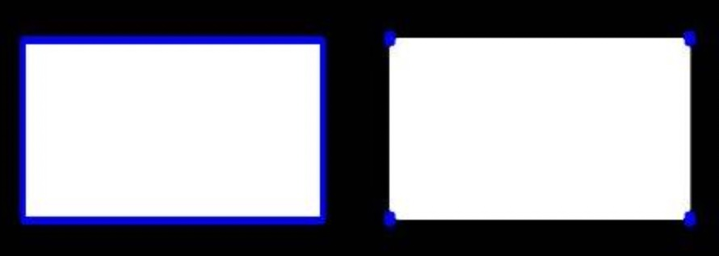

# Hand Gesture Recoginition using OpenCV #

## Preview

### Steps to install 

Make sure you have Python installed on your system.

clone the repository into your local system.

    git clone https://github.com/kumarpriyanshu2k2/Hand_gesture_recoginition_OpenCV.git
    

go to the directory in which you have cloned this project.

    cd ./Hand_gesture_recoginition_OpenCV

then install the required libraries using the following command:

    pip install -r requirements.txt

now you have installed all the required files, you can execute main.py

    python3 main.py

## Working:

### grey filter

It is a very important step that we require to perform in order to get the desired result

### Gaussian Blur

In Gaussian Blur operation, the image is convolved with a Gaussian filter instead of the box filter. The Gaussian filter is a low-pass filter that removes the high-frequency components are reduced.

You can perform this operation on an image using the Gaussianblur() method of the imgproc class. Following is the syntax of this method −

    GaussianBlur(src, dst, ksize, sigmaX)

- src − A Mat object representing the source (input image) for this operation.

- dst − A Mat object representing the destination (output image) for this operation.

- ksize − A Size object representing the size of the kernel.

- sigmaX − A variable of the type double representing the Gaussian kernel standard deviation in X direction.

### Thresholding the Image

Here, the matter is straight-forward. For every pixel, the same threshold value is applied. If the pixel value is smaller than the threshold, it is set to 0, otherwise it is set to a maximum value. The function cv.threshold is used to apply the thresholding. The first argument is the source image, which should be a grayscale image. The second argument is the threshold value which is used to classify the pixel values. The third argument is the maximum value which is assigned to pixel values exceeding the threshold. OpenCV provides different types of thresholding which is given by the fourth parameter of the function. Basic thresholding as described above is done by using the type cv.THRESH_BINARY. All simple thresholding types are:

- cv2.THRESH_BINARY
- cv2.THRESH_BINARY_INV
- cv2.THRESH_TRUNC
- cv2.THRESH_TOZERO
- cv2.THRESH_TOZERO_INV

In this project cv2.THRESH_BINARY_INV is used

    ret,thresh= cv2.threshold(blur,127,255,cv2.THRESH_BINARY_INV+cv2.THRESH_OTSU)

### Contours

Contours can be explained simply as a curve joining all the continuous points (along the boundary), having same color or intensity. The contours are a useful tool for shape analysis and object detection and recognition.

For better accuracy, use binary images. So before finding contours, apply threshold or canny edge detection.
Since OpenCV 3.2, findContours() no longer modifies the source image but returns a modified image as the first of three return parameters.
In OpenCV, finding contours is like finding white object from black background. So remember, object to be found should be white and background should be black.

    contours, hierarchy = cv2.findContours(thresh, cv2.RETR_TREE, cv2.CHAIN_APPROX_SIMPLE)
    
    # Finding the contour with maximum area
    contour = max(contours, key=lambda x: cv2.contourArea(x))
    
    # Drawing the contour on the image
    cv2.drawContours(drawing, [contour], -1, (0, 255, 0), 0)

### contour approximation method

This is the third argument in cv2.findContours function. What does it denote actually?

Above, we told that contours are the boundaries of a shape with same intensity. It stores the (x,y) coordinates of the boundary of a shape. But does it store all the coordinates ? That is specified by this contour approximation method.

If you pass cv.CHAIN_APPROX_NONE, all the boundary points are stored. But actually do we need all the points? For eg, you found the contour of a straight line. Do you need all the points on the line to represent that line? No, we need just two end points of that line. This is what cv.CHAIN_APPROX_SIMPLE does. It removes all redundant points and compresses the contour, thereby saving memory.

Below image of a rectangle demonstrate this technique. Just draw a circle on all the coordinates in the contour array (drawn in blue color). First image shows points I got with cv2.CHAIN_APPROX_NONE (734 points) and second image shows the one with cv2.CHAIN_APPROX_SIMPLE (only 4 points). See, how much memory it saves!!!

